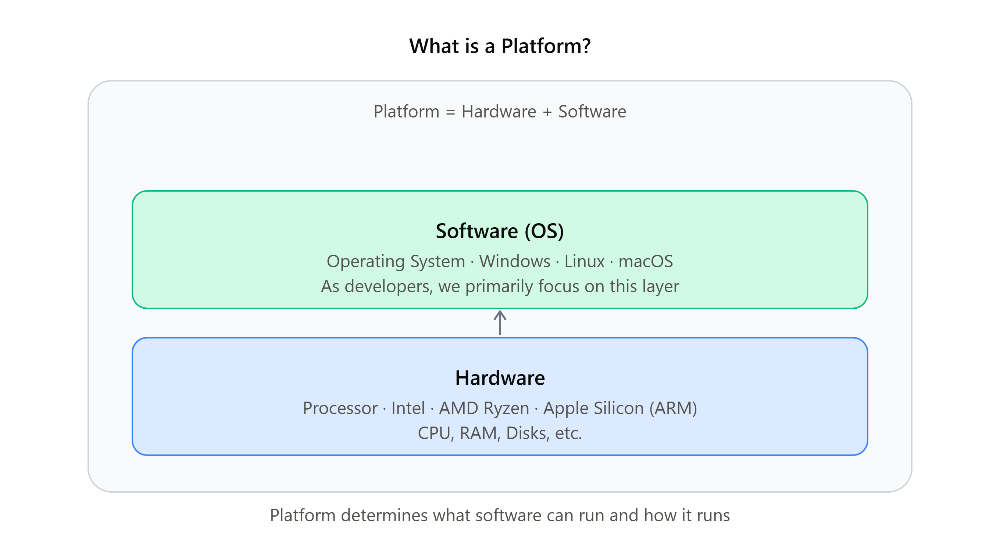
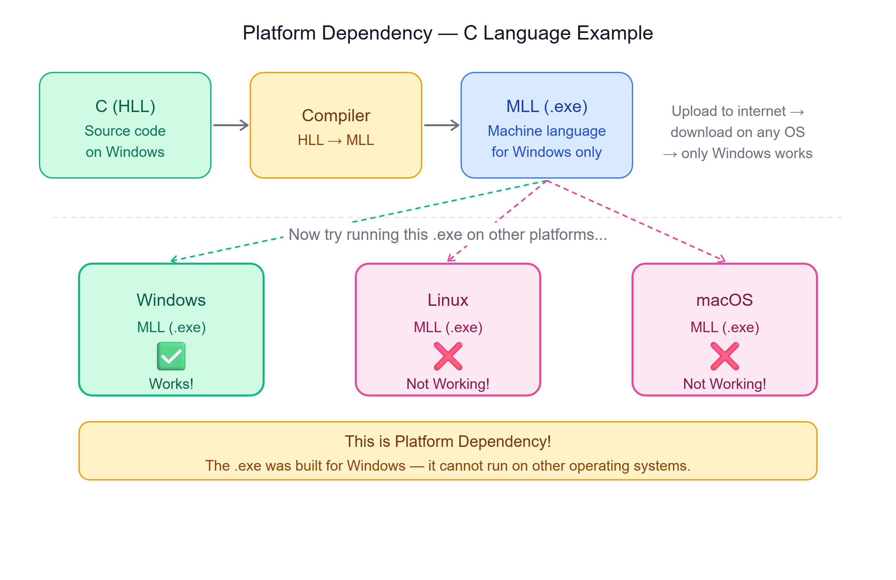

# 🖥️ Platform and Platform Dependency
### Understanding What a Platform Is and Why It Matters for Java

---

## 📌 Introduction

Java is renowned for its platform independence, often summarized by the term **WORA (Write Once, Run Anywhere)**.

Besides this, Java:
- Supports object-oriented programming
- Is an architecturally neutral language
- Is portable and robust

Before understanding these features, it is crucial to understand what **platform** and **platform dependency** mean.

---

## 🧱 What is a Platform?

A platform is a **combination of both software and hardware systems**.



| Component | Examples |
|-----------|---------|
| **Software** | Operating System — Linux, Windows, macOS |
| **Hardware** | Processor — Intel, AMD Ryzen, Apple Silicon (ARM) |

> As developers, we primarily focus on the **software aspects** of platforms.

---

## 🔗 What is Platform Dependency?

To understand platform dependency, consider this example:

Suppose we have a system running **Windows OS**, and we build an application in the **C language** (a High-Level Language / HLL).

For this application to execute, it must be **converted to Machine Level Language (MLL)** that the processor can understand. This conversion is done by a **compiler**, resulting in an executable file with a `.exe` extension.



Now, if we try to run this `.exe` file on systems with **different operating systems** like Linux or macOS — **it won't work**.

> The executable was created specifically for Windows OS — making it **platform-dependent**.

---

## ☕ How Java Achieves Platform Independence

In contrast to languages like C, **Java claims to be platform-independent**. But how?

Both Java and C use HLL for programming, converting it to MLL for execution. However, the converted MLL is typically **platform-dependent**.

```
C Language:
HLL (C code)  →  Compiler  →  MLL (.exe)  →  Works only on Windows ❌

Java:
HLL (Java code)  →  ???  →  Runs on any OS ✅
```

> Java overcomes this with a **unique approach** — explored in the next chapter on Java's internal architecture.

---

## 📝 Quick Revision

| Concept | Summary |
|---------|---------|
| Platform | Combination of hardware (processor) + software (OS) |
| Software (OS) | Windows, Linux, macOS |
| Hardware | Intel, AMD Ryzen, Apple Silicon (ARM) |
| Platform Dependency | A program compiled for one OS cannot run on another |
| Compiler | Converts HLL → MLL (.exe) |
| .exe file | Executable file — platform-specific (Windows only) |
| WORA | Write Once, Run Anywhere — Java's platform independence goal |

---

*Stay curious and keep learning! ☺*  
*Next Chapter → Internal architecture of Java and how it achieves platform independence*