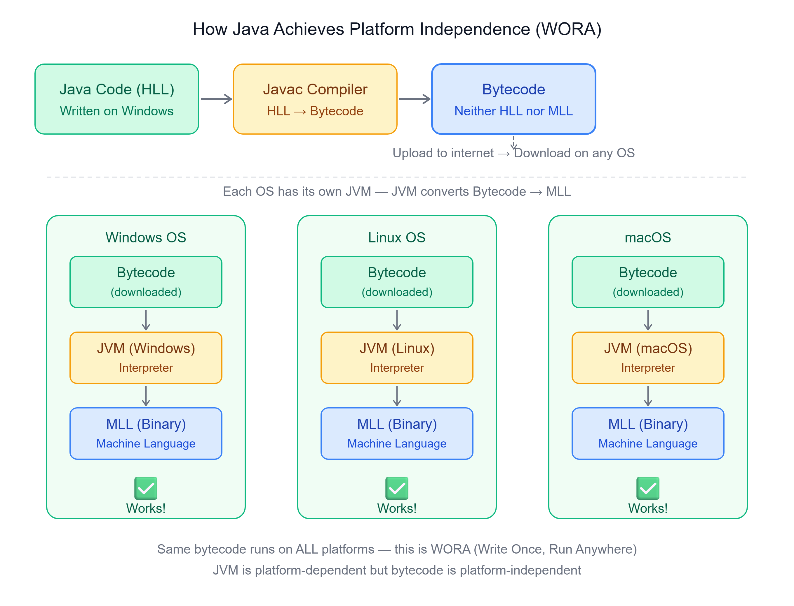

# ☕ How Java Made Platform Independent
### Understanding WORA — Write Once, Run Anywhere

---

## 📌 Introduction

In this chapter, let's understand how Java is made **platform independent** with an example.

Suppose we have three systems using different operating systems: **Linux, Windows, and macOS**. We will build an application based on Java.

When we write code in Java, we use a **High-Level Language (HLL)** which uses English-like syntax and symbols. This code needs to be converted into machine-level binary code by a system software called a **compiler**.

---

## 🔄 How Java Does It Differently

Java uses a **hybrid compiler** called the **Javac compiler**.

Unlike traditional compilers that directly convert HLL → MLL, the Javac compiler first converts the code into an **intermediate form called Bytecode**.

> Bytecode is **neither HLL nor MLL** — it lies somewhere in between.

To convert this bytecode into MLL, Java uses another component called the **Java Virtual Machine (JVM)**.

---

## 🖼️ Full Flow Diagram



---

## 🔢 Example Workflow

### Step 1 — Development on Windows:
- Write Java code in HLL
- Use the **Javac compiler** to convert the code into **Bytecode**

### Step 2 — Sharing Bytecode:
- Upload the Bytecode generated on Windows to the network
- Other systems (Linux and macOS) **download the same Bytecode**

### Step 3 — Execution on Different Systems:
- Install the **JDK** specific to each operating system
- Each system's **JVM** (included in JDK) interprets the Bytecode
- The interpreter converts Bytecode → **Machine Level Language (Binary code)**
- The output is **consistent across all operating systems** ✅

```
Java Code (HLL)
      │
      ▼
Javac Compiler
      │
      ▼
  Bytecode  ──────────────────────────────────────┐
      │                    │                      │
      ▼                    ▼                      ▼
JVM (Windows)        JVM (Linux)            JVM (macOS)
      │                    │                      │
      ▼                    ▼                      ▼
MLL (Binary)         MLL (Binary)           MLL (Binary)
      │                    │                      │
      ▼                    ▼                      ▼
   ✅ Works            ✅ Works              ✅ Works
```

---

## 🔑 Key Points About JVM

### 1. Platform Dependent
Each operating system has its **own specific JVM**. JVMs differ for Windows, Linux, and macOS.

### 2. Part of JDK
When installing Java on any operating system, you download the **Java Development Kit (JDK)**, which includes the JVM.

### 3. Interpreter
The JVM uses an **interpreter** to convert Bytecode into machine-level language (binary code).

---

## ⚖️ C vs Java — Platform Independence Comparison

| Feature | C Language | Java |
|---------|-----------|------|
| Compiler output | MLL (.exe) | Bytecode (.class) |
| Platform specific? | Yes — .exe only runs on Windows | No — Bytecode runs anywhere |
| Needs JVM? | No | Yes — each OS has its own JVM |
| WORA support? | ❌ No | ✅ Yes |

---

## 📝 Quick Revision

| Concept | Summary |
|---------|---------|
| WORA | Write Once, Run Anywhere — Java's key feature |
| Javac compiler | Converts Java HLL → Bytecode (not directly to MLL) |
| Bytecode | Intermediate code — neither HLL nor MLL |
| JVM | Java Virtual Machine — converts Bytecode → MLL |
| JDK | Java Development Kit — includes JVM + tools |
| Interpreter | Component inside JVM that converts Bytecode → Binary code |
| Platform dependent | JVM (different for each OS) |
| Platform independent | Bytecode (same for all OS) |

---

*Stay curious and keep learning! ☺*  
*Next Chapter → JVM's internal architecture and how it converts Bytecode to Machine code*