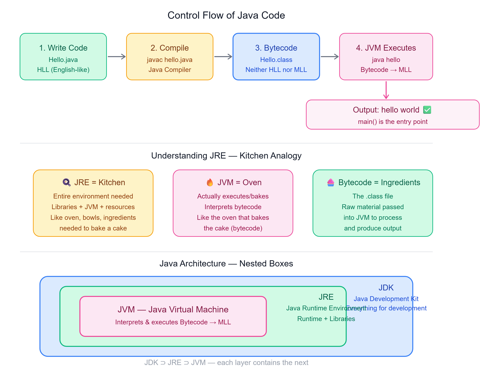

# ⚙️ How Java Works
### JVM, JRE, JDK and the Control Flow of a Java Program

---

## 📌 Introduction

When we write a Java program, we typically use tools like **JShell** to test our code. However, running a complete program requires understanding the role of the **Java Virtual Machine (JVM)** and the **Java Runtime Environment (JRE)**.

---

## 🔁 The Role of JVM

The JVM is an integral part of the Java ecosystem, allowing Java code to be **executed on any platform**.

Each operating system (OS) has a **specific JVM** designed for it — making Java:
- **Platform-independent** at the source code level
- **Platform-dependent** at the binary level

---

## 🔄 Control Flow of Java Code



Java code undergoes several stages from writing to execution:

| Step | Action | File |
|------|--------|------|
| 1 | Write Code | `Hello.java` (HLL) |
| 2 | Compile | `javac hello.java` |
| 3 | Bytecode generated | `Hello.class` |
| 4 | JVM executes | `java hello` → Output |

---

## 📝 Main Method

The JVM specifically looks for the **main method** as the entry point for any Java program.

```java
public class Hello {
    public static void main(String[] args) {
        System.out.print("hello world");
    }
}
```

> The main method is crucial — it marks the **starting point** of program execution.

---

## 🖥️ Steps to Write and Execute Java Code

1. **Write the Code** — Ensure all executable code is within the main method
2. **Follow OOP Principles** — Java is object-oriented; everything is treated as an object, and classes act as blueprints
3. **Compile the Code** — Use the Java compiler to compile your code
   - This generates a `.class` file containing bytecode
   ```
   javac hello.java
   ```
4. **Run the Code** — Use the `java` command followed by the class name (without `.class` extension)
   ```
   java hello
   ```
   Output:
   ```
   hello world
   ```

---

## 🍳 Understanding JRE — Kitchen Analogy

The JRE is essential for running Java programs. It includes the **JVM** and a set of **libraries and other files** that the JVM uses at runtime.

| Component | Kitchen Analogy |
|-----------|----------------|
| **JRE** | The entire kitchen setup — oven, bowls, ingredients |
| **JVM** | The oven — actually bakes (executes) the cake (bytecode) |
| **Bytecode** | The ingredients — raw material passed into JVM |

> 💡 Suppose you want to bake a cake. The **JRE** is the entire kitchen setup needed for baking. The **JVM** is the oven that actually bakes the cake using the **ingredients (bytecode)** provided.

---

## 📦 Java Architecture — Nested Boxes

Imagine the Java development environment as **nested boxes**:

```
┌──────────────────────────────────────────┐
│                  JDK                     │  ← Outer Box
│   (Java Development Kit)                 │
│   Everything needed for development      │
│                                          │
│   ┌──────────────────────────────────┐   │
│   │              JRE                 │   │  ← Middle Box
│   │   (Java Runtime Environment)     │   │
│   │   Runtime + Libraries            │   │
│   │                                  │   │
│   │   ┌──────────────────────────┐   │   │
│   │   │          JVM             │   │   │  ← Innermost Box
│   │   │  Java Virtual Machine    │   │   │
│   │   │  Interprets & executes   │   │   │
│   │   │  Bytecode → MLL          │   │   │
│   │   └──────────────────────────┘   │   │
│   └──────────────────────────────────┘   │
└──────────────────────────────────────────┘
```

- **Outer Box (JDK)** — The Java Development Kit includes everything for development
- **Middle Box (JRE)** — The JRE provides the runtime environment
- **Innermost Box (JVM)** — The JVM interprets and executes the bytecode

---

## 📝 Quick Revision

| Concept | Summary |
|---------|---------|
| JVM | Java Virtual Machine — executes bytecode, platform-specific |
| JRE | Java Runtime Environment — JVM + libraries needed to run Java |
| JDK | Java Development Kit — JRE + compiler + dev tools |
| `.java` file | Source code written in HLL |
| `.class` file | Bytecode generated after compilation |
| `javac` | Command to compile Java code |
| `java` | Command to run Java program |
| main method | Entry point of every Java program |
| JShell | Tool to test Java code quickly |

---

*Stay curious and keep learning! ☺*  
*Next Chapter → Deeper dive into JVM's internal architecture*