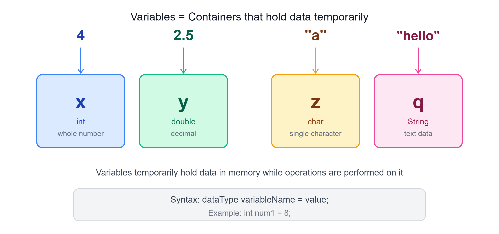

# 📦 Variables in Java
### Containers that Temporarily Hold Data

---

## 🔁 Recap

In the previous chapter, we learned about the control flow of code execution — JDK, JRE, and JVM.

> We used **JDK 17**, which is a **Long-Term Support (LTS)** version. A new version of the JDK is released every **six months**, each bringing new features and improvements.

---

## ❓ Why Do We Build Applications?

We build applications to **solve real-world problems**:
- Amazon → shop without visiting physical stores
- Food delivery apps → order meals without going to restaurants

All these applications rely on **large amounts of data** to function effectively. This data is processed and stored in a **database** (persistent storage), where it can be retrieved and updated as needed.

> During data processing, we need to **store data temporarily** — this is where **variables** come in.

**Variables act as containers that temporarily hold data while we perform operations on it.**

---

## 📦 Variables as Boxes



Variables x, y, z, and q are **boxes that hold the data** inside them.

Data can come in various forms:

| Data | Variable | Data Type |
|------|----------|-----------|
| `4` | x | `int` — whole number |
| `2.5` | y | `double` — decimal |
| `"a"` | z | `char` — single character |
| `"hello"` | q | `String` — text data |

---

## 💻 Code Example — Addition

Let's consider a simple example using two numbers and performing addition:

- `num1` = first variable with value `8` → `int` data type
- `num2` = second variable with value `5` → `int` data type
- `result` = stores the result of addition → also `int` data type

```java
class hello {
    public static void main(String[] args) {
        int num1 = 8;
        int num2 = 5;
        int result = num1 + num2;
        System.out.println(result);
    }
}
```

**Compile and Run:**
```
javac hello.java
java hello
13
```

> Each time we modify our code, we must **compile it before running** — changes in code affect the bytecode which alters the output.

Using variables allows us to **store and manipulate data dynamically**, making our code more **flexible and maintainable**.

---

## 🛠️ Creating Variables in Java

When we create variables in Java, there are 3 key steps:

### Step 1 — Specify the Data Type
The data type determines what kind of data the variable can hold:
- `int` → integers
- `double` → decimals
- `char` → characters

### Step 2 — Give the Variable a Name
- Name should be **meaningful**
- Follow Java's naming convention: **camelCase**
- Example: `studentAge`, `totalPrice`, `firstName`

### Step 3 — Assign a Value
Assign a value using the assignment operator `=`. This is called **initialization**:

```java
int number = 10;
```

You can also **declare without assigning** a value — Java assigns a **default value**:

```java
int number;   // default value = 0
```

---

## 🔢 Default Values in Java

If you don't assign a value during declaration, Java automatically assigns a default:

| Data Type | Default Value |
|-----------|--------------|
| `int` | `0` |
| `double` | `0.0` |
| `char` | `'\u0000'` (null character) |
| `boolean` | `false` |
| `String` / Objects | `null` |

---

## ✅ Steps to Remember While Coding

1. **Use semicolons correctly** — Every statement must end with `;` to avoid syntax errors
2. **Correct use of Curly Braces `{}`** — They define code blocks; missing braces prevent compilation
3. **Proper Indentation** — Makes code more readable and easier to understand

---

## 📝 Quick Revision

| Concept | Summary |
|---------|---------|
| Variable | Container that temporarily holds data |
| Data Type | Defines what kind of data a variable can hold |
| `int` | Whole numbers (e.g., 8, 5, 13) |
| `double` | Decimal numbers (e.g., 2.5) |
| `char` | Single character (e.g., 'a') |
| `String` | Text data (e.g., "hello") |
| Initialization | Assigning a value at the time of declaration |
| Default value | Value Java assigns when no value is provided |
| camelCase | Java naming convention for variables |
| `javac` | Compile command — must run after every code change |

---

*Stay curious and keep learning! ☺*