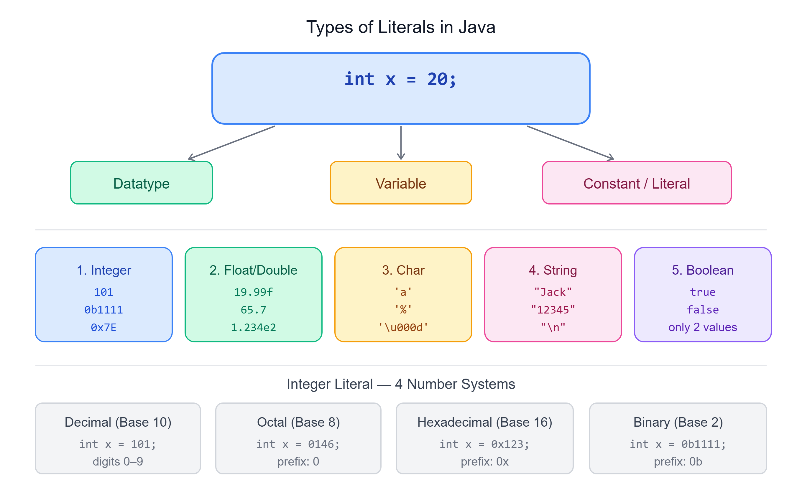

# 🔢 Literals in Java

---

## 📌 What are Literals?

Literals in Java represent **fixed values** directly in the source code. They are **constants** that can be assigned to variables and come in various types.

```java
int x = 20;
```

| Part | Meaning |
|------|---------|
| `int` | Datatype |
| `x` | Variable |
| `20` | Constant / Literal |

---

## 🗂️ Types of Literals in Java

.png>)

Java supports several types of literals:

1. Integer Literals
2. Character Literals
3. Boolean Literals
4. String Literals
5. Floating Point Literals



---

## 1️⃣ Integer Literals

Integer literals represent whole numbers and can be expressed in **four different number systems**:

### Decimal (Base 10)
Uses digits 0–9.
```java
int decimal = 101; // Decimal literal
```

### Octal (Base 8)
Uses digits 0–7, prefixed with `0`.
```java
int octal = 0146; // Octal literal (equals 102 in decimal)
```

### Hexadecimal (Base 16)
Uses digits 0–9 and letters a-f (or A-F), prefixed with `0x` or `0X`.
```java
int hex = 0x123Face; // Hexadecimal literal
```

### Binary (Base 2)
Uses digits 0 and 1, prefixed with `0b` or `0B`.
```java
int binary = 0b1111; // Binary literal (equals 15 in decimal)
```

---

## 2️⃣ Character Literals

Character literals are **single characters enclosed in single quotes**. They can also represent special characters using escape sequences.

```java
char letter = 'a';
char symbol = '%';
char unicodeChar = '\u000d'; // Unicode representation
```

---

## 3️⃣ Boolean Literals

Boolean literals represent truth values and can **only be `true` or `false`**.

```java
boolean isJavaFun = true;
boolean isFishMammal = false;
```

---

## 4️⃣ String Literals

String literals are **sequences of characters enclosed in double quotes**.

```java
String name = "Jack";
String number = "12345";
String newLine = "\n"; // Newline character
```

---

## 5️⃣ Floating Point Literals

Floating point literals represent numbers with fractional parts and can be of type `float` or `double`.

### Float Literals
Ends with `F` or `f`.
```java
float price = 19.99f;
```

### Double Literals
Ends with `D` or `d` (optional).
```java
double weight = 65.7;
double scientific = 1.234e2; // Exponent notation
```

---

## ⚠️ Invalid Literals and Restrictions

Using underscores in numeric literals can enhance readability, but there are restrictions:

- Cannot start or end a number with an underscore
- Cannot place an underscore adjacent to a decimal point in a floating-point literal
- Cannot place an underscore adjacent to `F` or `L` suffixes

### Invalid Examples:
```java
int invalid = 77_;            // ❌ Invalid: underscore at the end
float invalidFloat = 6_.674F; // ❌ Invalid: underscore before decimal
```

---

## 🤔 Why Use Literals?

Literals are used to **directly assign values** to variables without needing to define constants separately. They simplify code by **embedding constant values** within the instructions.

---

## ❓ FAQs on Literals

**1. What are literals in Java?**
Literals are fixed values assigned directly to variables in the source code.

**2. Can literals be changed during program execution?**
No, literals are constants and cannot be changed once defined.

**3. What is a real literal?**
Real literals represent floating-point numbers, like `12.34` or `1.23e3`.

**4. What is a null literal?**
A null literal represents the absence of an object reference, commonly assigned as `null`.

---

## 📝 Quick Revision

| Literal Type | Example | Notes |
|--------------|---------|-------|
| Decimal | `101` | Base 10 |
| Octal | `0146` | Base 8, prefix `0` |
| Hexadecimal | `0x123Face` | Base 16, prefix `0x` |
| Binary | `0b1111` | Base 2, prefix `0b` |
| Char | `'a'` | Single quotes |
| Boolean | `true` / `false` | No other values allowed |
| String | `"Jack"` | Double quotes |
| Float | `19.99f` | Ends with F/f |
| Double | `65.7` | Optional D/d suffix |
| Scientific | `1.234e2` | Exponent notation |

---

*Stay curious and keep learning! ☺*