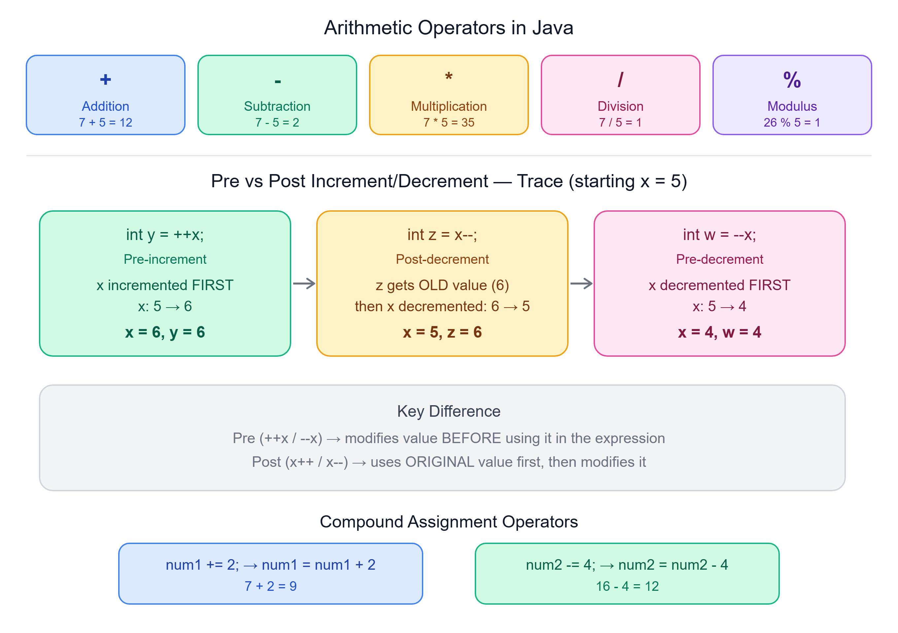

# ➕ Arithmetic Operators in Java

---

## 📌 Operators in Java

Operators are symbols that perform specific operations on one or more **operands**. In Java, we commonly use operators for basic arithmetic operations like addition (`+`), subtraction (`-`), multiplication (`*`), and division (`/`), as well as modulus (`%`).



---

## ➕ Example: Basic Arithmetic Operations

```java
int num1 = 7;
int num2 = 5;

// Addition
int res = num1 + num2;
System.out.println(res); // Output: 12
```

| Operator | Name | Description |
|----------|------|-------------|
| `+` | Addition | Adds two operands |
| `-` | Subtraction | Subtracts the second operand from the first |
| `*` | Multiplication | Multiplies two operands |
| `/` | Division | Divides the first operand by the second, giving the quotient |
| `%` | Modulus | Returns the remainder after division |

---

## 🔢 Example: Modulus Operation

```java
int num1 = 26;
int num2 = 5;
int res = num1 % num2;
System.out.println(res); // Output: 1
```

> `26 % 5` equals `1` because 26 divided by 5 is 5 with a **remainder of 1**.

---

## ➕➖ Increment and Decrement Operators

The increment (`++`) and decrement (`--`) operators always change the value by **1**. These can be applied in two forms: **pre** and **post**.

| Type | Syntax | Behavior |
|------|--------|----------|
| Pre-increment | `++x` | Increases value **before** the operation is performed |
| Pre-decrement | `--x` | Decreases value **before** the operation is performed |
| Post-increment | `x++` | Increases value **after** the operation is performed |
| Post-decrement | `x--` | Decreases value **after** the operation is performed |

---

## 🧮 Example: Compound Assignment Operators

```java
int num1 = 7;
num1 += 2; // Equivalent to num1 = num1 + 2;
System.out.println(num1); // Output: 9

int num2 = 16;
num2 -= 4; // Equivalent to num2 = num2 - 4;
System.out.println(num2); // Output: 12
```

---

## 🔍 Example: Pre and Post Increment/Decrement

```java
public class IncrementDecrementExample {
    public static void main(String[] args) {
        int x = 5;
        int y = ++x;  // Pre-increment: x is incremented first, then assigned to y
        System.out.println("After pre-increment: x = " + x + ", y = " + y);

        int z = x--;  // Post-decrement: x is assigned to z, then decremented
        System.out.println("After post-decrement: x = " + x + ", z = " + z);

        int w = --x;  // Pre-decrement: x is decremented first, then assigned to w
        System.out.println("After pre-decrement: x = " + x + ", w = " + w);
    }
}
```

**Output:**
```
After pre-increment: x = 6, y = 6
After post-decrement: x = 5, z = 6
After pre-decrement: x = 4, w = 4
```

---

## 🔎 Explanation

1. **Pre-increment (`++x`)**: `x` is incremented first, so `x` becomes `6`, and then `y` is assigned the value of `x`, making `y = 6`.
2. **Post-decrement (`x--`)**: The current value of `x` (which is `6`) is assigned to `z`, and then `x` is decremented, making `x = 5`.
3. **Pre-decrement (`--x`)**: `x` is decremented first, so `x` becomes `4`, and then `w` is assigned the value of `x`, making `w = 4`.

---

## 🔑 Key Differences

- **Pre-increment/decrement**: Modifies the variable's value **before** using it in an expression.
- **Post-increment/decrement**: Uses the variable's **original** value in the expression **before** modifying it.

---

## 📝 Quick Revision

| Concept | Summary |
|---------|---------|
| `+` `-` `*` `/` `%` | Basic arithmetic operators |
| Modulus (`%`) | Returns remainder after division |
| `+=` `-=` | Compound assignment operators |
| `++x` / `--x` | Pre-increment/decrement — modifies before use |
| `x++` / `x--` | Post-increment/decrement — uses original value first |

---

*Stay curious and keep learning! ☺*