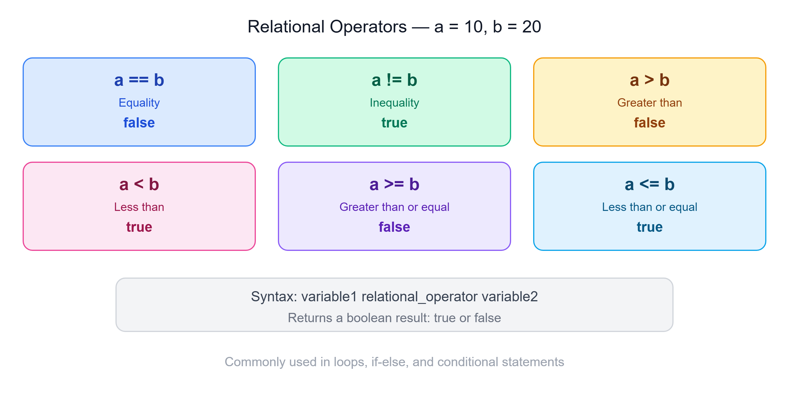

# ⚖️ Relational Operators in Java

---

## 📌 Overview

Java Relational Operators are **binary operators** that are used to evaluate relationships between two operands — such as equality, greater than, less than, and so on.

These comparisons **return boolean results**, and they are commonly used in:
- Looping statements
- Conditional `if-else` statements
- Similar constructs

---

## ✍️ Syntax

```
variable1  relational_operator  variable2
```

---

## 📊 Types of Relational Operators



| Operator | Name | Description |
|----------|------|-------------|
| `==` | Equality | Checks if two values are equal |
| `!=` | Inequality | Checks if two values are not equal |
| `>` | Greater than | Checks if the left operand is greater than the right operand |
| `<` | Less than | Checks if the left operand is less than the right operand |
| `>=` | Greater than or equal to | Checks if the left operand is greater than or equal to the right operand |
| `<=` | Less than or equal to | Checks if the left operand is less than or equal to the right operand |

---

## 💻 Examples of Each Operator

```java
int a = 10;
int b = 20;

// Equality (==)
System.out.println(a == b); // Output: false

// Inequality (!=)
System.out.println(a != b); // Output: true

// Greater than (>)
System.out.println(a > b); // Output: false

// Less than (<)
System.out.println(a < b); // Output: true

// Greater than or equal to (>=)
System.out.println(a >= b); // Output: false

// Less than or equal to (<=)
System.out.println(a <= b); // Output: true
```

---

## 📝 Quick Revision

| Expression | a = 10, b = 20 | Result |
|------------|----------------|--------|
| `a == b` | Is a equal to b? | `false` |
| `a != b` | Is a not equal to b? | `true` |
| `a > b` | Is a greater than b? | `false` |
| `a < b` | Is a less than b? | `true` |
| `a >= b` | Is a greater than or equal to b? | `false` |
| `a <= b` | Is a less than or equal to b? | `true` |

---

*Stay curious and keep learning! ☺*