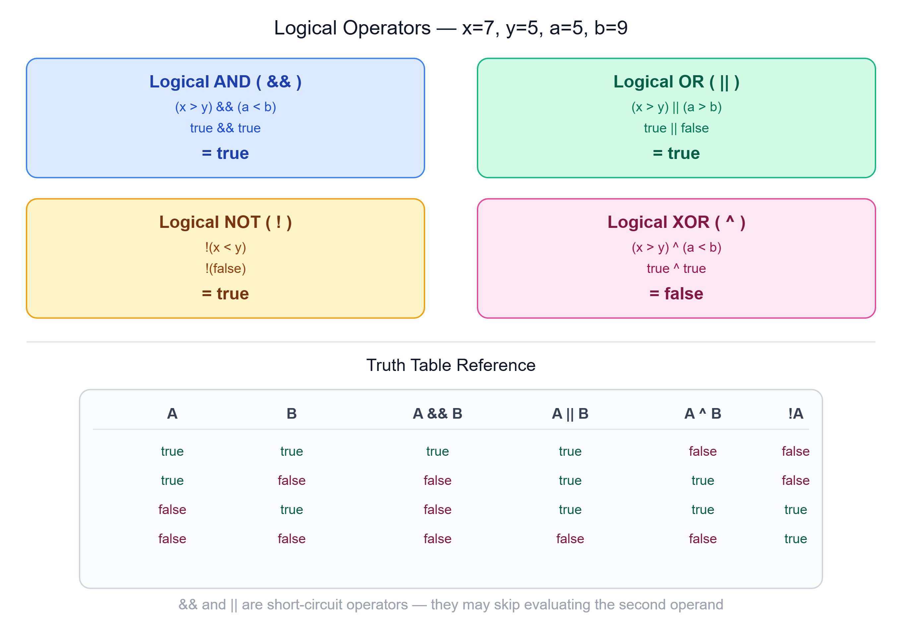

# 🔀 Logical Operators in Java

---

## 📌 Overview

Logical operators in Java are used to perform logical operations on **boolean expressions**. These operators are crucial for **decision-making** in programs.



---

## 1️⃣ Logical AND (`&` and `&&`)

- **`&` (Bitwise AND)** — Evaluates **both** operands
- **`&&` (Short-Circuit AND)** — Evaluates the second operand **only if the first is true**

### Example:

```java
int x = 7, y = 5, a = 5, b = 9;
boolean result = (x > y) && (a < b);
System.out.println(result); // Output: true
```

> **Explanation:** Both conditions `(x > y)` and `(a < b)` are true, so the result is `true`.

---

## 2️⃣ Logical OR (`|` and `||`)

- **`|` (Bitwise OR)** — Evaluates **both** operands
- **`||` (Short-Circuit OR)** — Evaluates the second operand **only if the first is false**

### Example:

```java
boolean result = (x > y) || (a > b);
System.out.println(result); // Output: true
```

> **Explanation:** The first condition `(x > y)` is true, so the result is `true` regardless of the second condition.

---

## 3️⃣ Logical NOT (`!`)

- **`!`** — Inverts the boolean value of an expression

### Example:

```java
boolean result = !(x < y);
System.out.println(result); // Output: true
```

> **Explanation:** Since `(x < y)` is `false`, `!(x < y)` becomes `true`.

---

## 4️⃣ Logical XOR (`^`)

- If **precisely one** operand is true, returns `true`; otherwise returns `false`

### Example:

```java
boolean result = (x > y) ^ (a < b);
System.out.println(result); // Output: false
```

> **Explanation:** Both `(x > y)` and `(a < b)` are true, so the XOR result is `false`.

---

## 💻 Example Program Combining All Logical Operators

```java
public class LogicalOperatorsExample {
    public static void main(String[] args) {
        int x = 7, y = 5, a = 5, b = 9;

        // AND operation
        boolean andResult = (x > y) && (a < b);
        System.out.println("AND Result: " + andResult); // Output: true

        // OR operation
        boolean orResult = (x > y) || (a > b);
        System.out.println("OR Result: " + orResult); // Output: true

        // NOT operation
        boolean notResult = !(x < y);
        System.out.println("NOT Result: " + notResult); // Output: true

        // XOR operation
        boolean xorResult = (x > y) ^ (a < b);
        System.out.println("XOR Result: " + xorResult); // Output: false
    }
}
```

---

## 🔑 Key Points

- **Logical AND (`&&`)** and **Logical OR (`||`)** are **short-circuit operators**, meaning they can skip evaluating the second operand if the result is already determined by the first operand.
- **Logical NOT (`!`)** negates the boolean value of an expression.
- **Logical XOR (`^`)** is true only if **exactly one** of the operands is true.

---

## 📝 Quick Revision

| Operator | Name | Rule |
|----------|------|------|
| `&&` | Short-Circuit AND | true only if **both** are true |
| `\|\|` | Short-Circuit OR | true if **at least one** is true |
| `!` | NOT | inverts the boolean value |
| `^` | XOR | true only if **exactly one** is true |
| `&` | Bitwise AND | evaluates both operands always |
| `\|` | Bitwise OR | evaluates both operands always |

---

*Stay curious and keep learning! ☺*