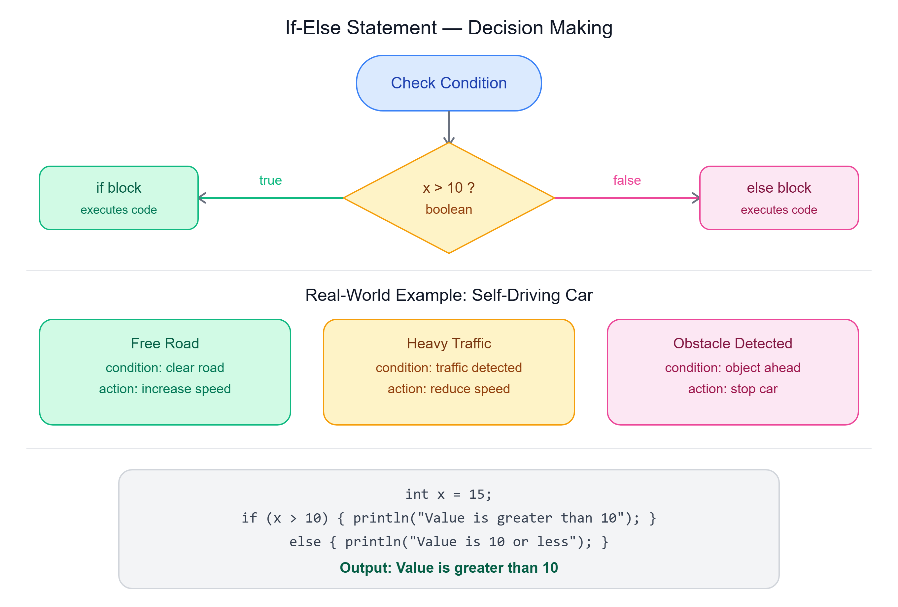

# 🔀 If-Else Statement

---

## 📌 Conditional Statement

Conditional statements in programming are essential for **controlling the flow** of a program based on specific conditions. These statements enable the execution of **different blocks of code** depending on whether a given condition evaluates to `true` or `false`.

> This mechanism is fundamental for **decision-making** in algorithms.

---

## 🚗 Real-World Example

Consider an **automatic car** that adjusts its speed based on road conditions:



1. **Free Road/Highway** — The car increases its speed when the road is clear
2. **Heavy Traffic** — The car reduces its speed automatically when there is heavy traffic
3. **Obstacle Detection** — The car stops if an obstacle or person comes in front of it

> These actions are based on **conditions**, demonstrating the practical use of conditional statements.

---

## 🔧 if-else Statement

The `if-else` statement extends the `if` statement by adding an `else` clause.

- If the condition is `true` → the code in the **if block** executes
- If the condition is `false` → the code in the **else block** executes

---

## 1️⃣ Basic if Statement

```java
int x = 8;
System.out.println("hello");
System.out.println("bye");

// Applying an if condition
if (x > 10) {
    // The condition requires a boolean value (true or false)
    System.out.println("hello");
}
// No output for this condition as x is not greater than 10
```

---

## 2️⃣ if with Logical Operators

```java
int x = 18;
if (x > 10 && x <= 20) { // using logical operations with two expressions
    System.out.println("hello"); // Output: hello
}
```

---

## 📝 Syntax of if-else

In Java, the syntax for an if-else statement:

- If the condition is `true`, the block of code within the `if` statement is executed
- If there is **only one statement**, curly braces `{}` are **optional**
- If there are **multiple statements**, curly braces are **mandatory** to group them together

---

## 3️⃣ Complete if-else Example

```java
int x = 15;
if (x > 10) {
    System.out.println("Value is greater than 10");
} else {
    System.out.println("Value is 10 or less");
}
```

**Output:**
```
Value is greater than 10
```

---

## 🔑 Key Points to Remember

- **Indentation** in Java does not affect execution but helps make the code clean and easy to understand
- `if` conditions always evaluate to **boolean values** (`true` or `false`)

---

## 📝 Quick Revision

| Concept | Summary |
|---------|---------|
| Conditional statement | Controls flow based on true/false conditions |
| if statement | Executes code block only if condition is true |
| if-else statement | Executes if block when true, else block when false |
| Curly braces `{}` | Optional for single statement, mandatory for multiple |
| Boolean condition | if always evaluates to true or false |
| Indentation | Doesn't affect execution — only for readability |

---

*Stay curious and keep learning! ☺*