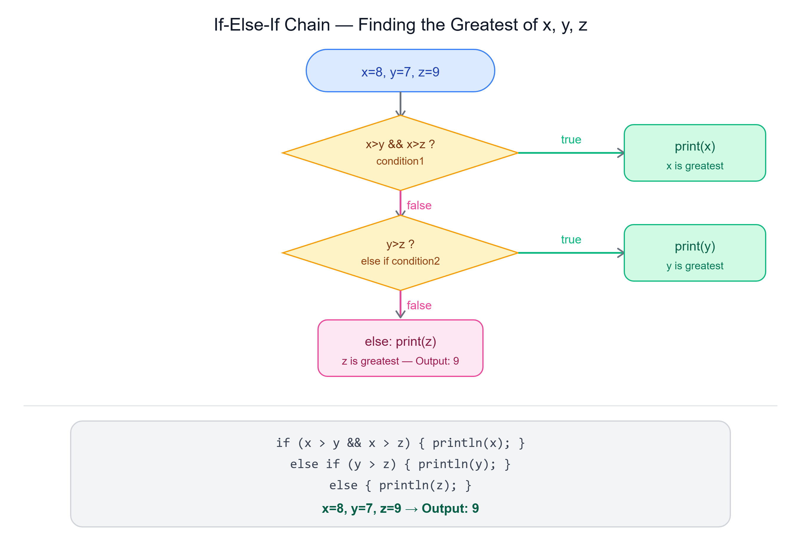

# 🔗 If-Else-If Statement

---

## 📌 Overview

The **if-else if** statement allows for **multiple conditions** to be checked in sequence. If the `if` condition is false, the program checks the next `else if` condition, and so on.


---

## ✍️ Syntax

```java
if (condition1) {
    // code to execute if condition1 is true
} else if (condition2) {
    // code to execute if condition2 is true
} else {
    // code to execute if all conditions are false
}
```

---

## 🎯 Example: Finding the Greatest of Three Values

To determine the greatest value among three variables (`x`, `y`, and `z`), we can use if-else if statements along with logical operators. This is a common programming scenario where conditional logic helps in decision-making based on multiple criteria.

---

### Example 1 — Basic Comparison

```java
int x = 8, y = 7, z = 6;
if (x > y && x > z) {
    System.out.println(x);
} else {
    System.out.println(y);
}
```
**Output:** `8`

---

### Example 2 — Adjusted Values

```java
z = 9;
if (x > y && x > z) {
    System.out.println(x);
} else {
    System.out.println(y); // Output: 7
}
```
**Output:** `7`

---

### Example 3 — Additional Condition

```java
y = 17;
if (x > y && x > z) { // Checking if x is the greatest
    System.out.println(x);
} else if (y > x && y > z) { // Checking if y is the greatest
    System.out.println(y); // Output: 17
}
```
**Output:** `17`

---

### Example 4 — Complete Comparison with else Block

```java
x = 8;
y = 7;
z = 9;
if (x > y && x > z) { // Checking if x is the greatest
    System.out.println(x);
} else if (y > z) { // Checking if y is the greatest
    System.out.println(y);
} else {
    System.out.println(z); // Output: 9
}
```
**Output:** `9`

---

## 🔑 Key Points

- **Logical Operators** — Used to combine multiple conditions (e.g., `&&` for "and")
- **Conditional Blocks** — Use curly braces `{}` for clarity, especially with multiple statements
- **Complete Conditions** — Always cover all possible scenarios, including the final `else` block

---

## 📝 Quick Revision

| Concept | Summary |
|---------|---------|
| if-else if | Checks multiple conditions in sequence |
| else if | Runs only if the previous condition was false |
| else | Final fallback if all conditions are false |
| `&&` | Combines conditions — both must be true |
| Complete conditions | Always include a final else to cover all cases |

---

*Stay curious and keep learning! ☺*