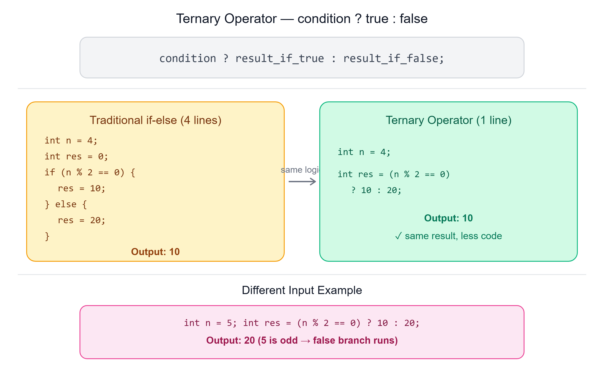

# ❓ Ternary Operator in Java

---

## 📌 Overview

The **ternary operator** is a concise way to write an **if-else statement**. It involves three operands:
1. A **condition**
2. A **result for when the condition is true**
3. A **result for when the condition is false**

> This operator can help reduce the lines of code required for simple conditional assignments.



---

## ✍️ Syntax

```java
condition ? result_if_true : result_if_false;
```

---

## 🔍 Implementation: Checking if a Number is Even or Odd

### Using Simple if-else Approach

```java
int n = 4;
int res = 0;
if (n % 2 == 0) {
    res = 10;
} else {
    res = 20;
}
System.out.println(res); // Output: 10
```

### Using Ternary Operator

```java
int n = 4;
int res = (n % 2 == 0) ? 10 : 20;
System.out.println(res); // Output: 10
```

> Both approaches give the **same result** — but the ternary operator does it in **one line** instead of four.

---

## 🔢 Example with Different Input

```java
int n = 5;
int res = (n % 2 == 0) ? 10 : 20;
System.out.println(res); // Output: 20
```

Since `5 % 2` is not `0`, the condition is `false`, so the **false branch** (`20`) is returned.

---

## 🔑 Key Points

- **Conciseness** — The ternary operator reduces the number of lines needed for simple condition checks
- **Readability** — While it makes code more compact, it should be used carefully to maintain readability, especially for more complex conditions
- **Limitations** — Best suited for straightforward if-else scenarios; may not work well for cases involving multiple statements or complex logic

---

## 📝 Quick Revision

| Concept | Summary |
|---------|---------|
| Ternary operator | Shorthand for simple if-else statements |
| Syntax | `condition ? result_if_true : result_if_false;` |
| Operands | 3 — condition, true result, false result |
| Best used for | Simple, single-value conditional assignments |
| Not ideal for | Complex logic with multiple statements |

---

*Stay curious and keep learning! ☺*