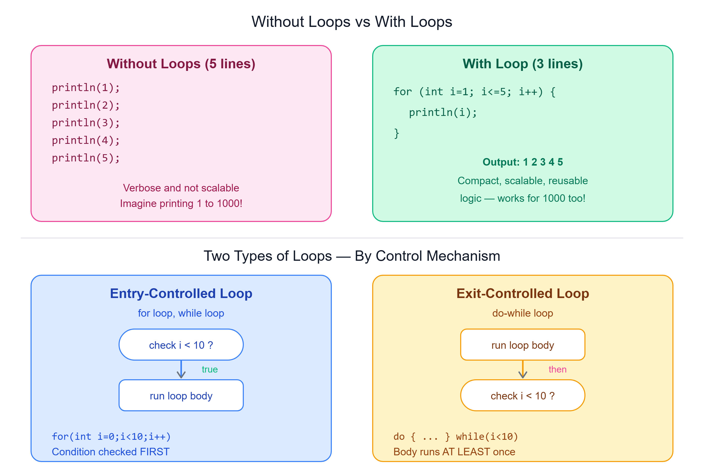

# 🔁 Need For Loops

---

## 📌 What are Loops?

Loops, also known as **iterative statements**, are crucial in programming for executing a block of code **repetitively**. They allow for the repeated execution of a set of instructions or a code block as long as a **specified condition** is met.

> Loops are fundamental to the concept of **iteration**, enhancing code efficiency, readability, and promoting the **reuse of code logic**.



---

## 🔍 Example: Iterative Statements Without and With Loops

### Without Loops

Consider a scenario where you want to print numbers from 1 to 5. Without using loops, you would need to write multiple lines of code:

```java
System.out.println(1);
System.out.println(2);
System.out.println(3);
System.out.println(4);
System.out.println(5);
```

> This approach is **verbose and not scalable**.

### With Loops

The same task can be accomplished using a loop, which is more compact and efficient:

```java
for (int i = 1; i <= 5; i++) {
    System.out.println(i);
}
```

> This loop iterates from 1 to 5, printing each number, demonstrating the power of loops in **reducing code complexity**.

---

## 🗂️ Types of Loops

Loops can be categorized based on the control mechanism into **two main types**: entry-controlled loops and exit-controlled loops.

---

## 1️⃣ Entry-Controlled Loops

- The **test condition is checked before** entering the main body of the loop
- Examples: **for loop**, **while loop**

### Example of an Entry-Controlled Loop:

```java
for (int i = 0; i < 10; i++) {
    System.out.println(i);
}
```

> In this example, the condition `i < 10` is checked **before** executing the loop body.

---

## 2️⃣ Exit-Controlled Loops

- The **test condition is evaluated at the end** of the loop body, ensuring that the loop body will execute **at least once**, regardless of whether the condition is true or false
- Example: **do-while loop**

### Example of an Exit-Controlled Loop:

```java
int i = 0;
do {
    System.out.println(i);
    i++;
} while (i < 10);
```

> In this example, the do-while loop **executes the loop body first** and then checks the condition `i < 10`.

---

## 📝 Quick Revision

| Concept | Summary |
|---------|---------|
| Loop | Repeats a block of code as long as a condition is met |
| Entry-controlled loop | Condition checked BEFORE loop body runs (for, while) |
| Exit-controlled loop | Condition checked AFTER loop body runs (do-while) |
| Key benefit | Body always runs at least once in exit-controlled loops |
| Why use loops | Reduces code repetition, improves scalability and readability |

---

*Stay curious and keep learning! ☺*