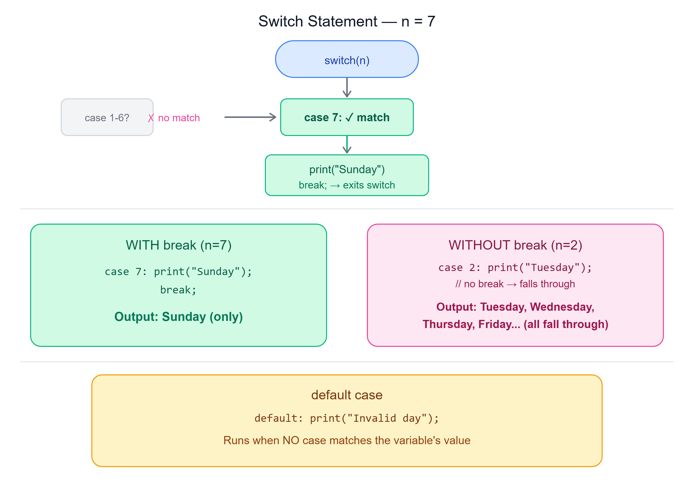

# 🔀 Switch Statement in Java

---

## 📌 Overview

The **switch statement** is used to evaluate a variable against a series of values, offering a more **readable alternative to lengthy if-else-if chains**.

Each block in a switch statement is represented by a **case**, and typically, the execution of a case block is terminated using the **break** keyword.
                
   


---

## ✍️ Syntax

```java
switch (variable) {
    case value1:
        // code to execute if variable equals value1
        break;
    case value2:
        // code to execute if variable equals value2
        break;
    default:
        // code to execute if variable doesn't match any case
}
```

---

## 🎯 Use Cases of Switch Statement

- **Selecting a Code Block** — Efficiently choose one among many code blocks to execute based on the value of a variable
- **Handling Multiple Cases** — Manage multiple scenarios clearly and concisely

---

## 📅 Example: Printing Weekdays

Let's consider an example where we want to print the name of the day based on a number:

- **Using if-else-if approach**: If `n = 1` to `7`, we need to use multiple if-else blocks to print the corresponding weekday
- **Using switch statement**: We can replace the complex if-else chain with a switch statement for clarity and efficiency

```java
switch(n) {
    case 1:
        System.out.println("Monday");
        break;
    case 2:
        System.out.println("Tuesday");
        break;
    case 3:
        System.out.println("Wednesday");
        break;
    case 4:
        System.out.println("Thursday");
        break;
    case 5:
        System.out.println("Friday");
        break;
    case 6:
        System.out.println("Saturday");
        break;
    case 7:
        System.out.println("Sunday");
        break;
    default:
        System.out.println("Invalid day");
}
```

**Output (when n = 7):**
```
Sunday

=== Code Execution Successful ===
```

> In this example, if `n` is `2`, the output will be **"Tuesday"**.

---

## ⚠️ The Importance of `break`

The **break** statement prevents the execution from **falling through** to subsequent cases.

Without the break statement, the program would **continue executing** the following cases until it encounters a break or reaches the end of the switch block.

### Example Without `break` (n = 2):

```java
switch(n) {
    case 1:
        System.out.println("Monday");
        //break;
    case 2:
        System.out.println("Tuesday");
        // break;
    case 3:
        System.out.println("Wednesday");
        // break;
    case 4:
        System.out.println("Thursday");
        // break;
    case 5:
        System.out.println("Friday");
        // break;
    case 6:
        System.out.println("Saturday");
        //  break;
    case 7:
        System.out.println("Sunday");
        //   break;
    default:
        System.out.println("Invalid day");
}
```

**Output (when n = 2):**
```
Tuesday
Wednesday
Thursday
Friday
Saturday
Sunday
Invalid day

=== Code Execution Successful ===
```

> Notice how execution **"falls through"** every case after the match, all the way to `default`, because there's no `break` to stop it.

---

## 🔑 Key Points

- The **default case** is executed if none of the specified cases match the variable's value, ensuring that the program handles unexpected values gracefully
- **Note:** The `break` keyword is **crucial** in Java to prevent fall-through behaviour

---

## 📝 Quick Revision

| Concept | Summary |
|---------|---------|
| switch statement | Evaluates a variable against multiple case values |
| case | Represents one block of code to execute for a matching value |
| break | Stops execution from falling through to the next case |
| default | Executed when no case matches the variable's value |
| Fall-through | What happens when `break` is missing — execution continues into next cases |

---

*Stay curious and keep learning! ☺*